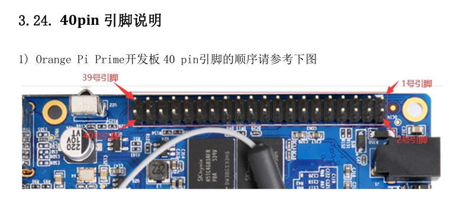
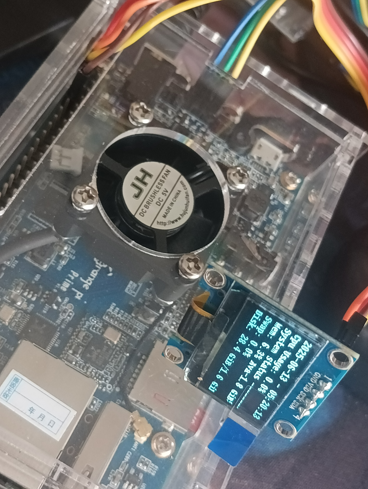

# OrangePiStausScreen
使用I2C接口在OLED上显示OrangePi的状态(使用` SSD1306 `)
> 系统时间

> 硬件状态
 - CPU使用率
 - CPU温度
 - 内存占用
 - 交换空间占用
 - 对外IP
 - 磁盘占用

> 当地天气情况(使用高德天气API和IP定位)

 - 在没网时建立缓存

 ## 使用
修改` config.json `
```
  "citycode": , //指定地区城市码（或Acode）
  "gaodeApikey": " ", //高德Api密钥
  "I2Cport": 0 //I2c总线号
```

## 接线定义 
 > 在对应开发板文档找到引脚方向
 

 #### 获取引脚定义
 ```
 git clone https://github.com/orangepi-xunlong/wiringOP
cd wiringOP
./build clean
./build
```
通过`gpio readall`获取引脚定义
> 例如

```

(.venv) root@orangepiprime:~/Code/tuii# gpio readall
 +------+-----+----------+------+---+   PRIME  +---+------+----------+-----+------+
 | GPIO | wPi |   Name   | Mode | V | Physical | V | Mode | Name     | wPi | GPIO |
 +------+-----+----------+------+---+----++----+---+------+----------+-----+------+
 |      |     |     3.3V |      |   |  1 || 2  |   |      | 5V       |     |      |
 |   12 |   0 |    SDA.0 | ALT2 | 0 |  3 || 4  |   |      | 5V       |     |      |
 |   11 |   1 |    SCL.0 | ALT2 | 0 |  5 || 6  |   |      | GND      |     |      |
 |    6 |   2 |    PWM.1 |  OFF | 0 |  7 || 8  | 0 | OFF  | PC05     | 3   | 69   |
 |      |     |      GND |      |   |  9 || 10 | 0 | OFF  | PC06     | 4   | 70   |
 |    1 |   5 |    RXD.2 |  OFF | 0 | 11 || 12 | 0 | OFF  | PD14     | 6   | 110  |
 |    0 |   7 |    TXD.2 |  OFF | 0 | 13 || 14 |   |      | GND      |     |      |
 |    3 |   8 |    CTS.2 |  OFF | 0 | 15 || 16 | 0 | OFF  | PC04     | 9   | 68   |
 |      |     |     3.3V |      |   | 17 || 18 | 0 | OFF  | PC07     | 10  | 71   |
 |   15 |  11 |   MOSI.1 |  OUT | 1 | 19 || 20 |   |      | GND      |     |      |
 |   16 |  12 |   MISO.1 |  OFF | 0 | 21 || 22 | 0 | OFF  | RTS.2    | 13  | 2    |
 |   14 |  14 |   SCLK.1 |  OFF | 0 | 23 || 24 | 0 | OFF  | CE.1     | 15  | 13   |
 |      |     |      GND |      |   | 25 || 26 | 0 | OFF  | PC08     | 16  | 72   |
 |   19 |  17 |    SDA.1 | ALT3 | 0 | 27 || 28 | 0 | ALT3 | SCL.1    | 18  | 18   |
 |    7 |  19 |     PA07 |  OFF | 0 | 29 || 30 |   |      | GND      |     |      |
 |    8 |  20 |     PA08 |  OFF | 0 | 31 || 32 | 0 | OFF  | PC09     | 21  | 73   |
 |    9 |  22 |     PA09 |  OFF | 0 | 33 || 34 |   |      | GND      |     |      |
 |   10 |  23 |     PA10 |  OFF | 0 | 35 || 36 | 0 | OFF  | PC10     | 24  | 74   |
 |  107 |  25 |     PD11 |  OFF | 0 | 37 || 38 | 0 | OFF  | PC11     | 26  | 75   |
 |      |     |      GND |      |   | 39 || 40 | 0 | OFF  | PC12     | 27  | 76   |
 +------+-----+----------+------+---+----++----+---+------+----------+-----+------+
 | GPIO | wPi |   Name   | Mode | V | Physical | V | Mode | Name     | wPi | GPIO |
 +------+-----+----------+------+---+   PRIME  +---+------+----------+-----+------+
```
配置文件默认使用第一组`"I2Cport": 0`
插上I2c屏幕后 通过`i2cdetect -y [I2C总线号]`查询是否存在 
>  例如
```
(.venv) root@orangepiprime:~/Code/tuii# i2cdetect -y 0
     0  1  2  3  4  5  6  7  8  9  a  b  c  d  e  f
00:          -- -- -- -- -- -- -- -- -- -- -- -- --
10: -- -- -- -- -- -- -- -- -- -- -- -- -- -- -- --
20: -- -- -- -- -- -- -- -- -- -- -- -- -- -- -- --
30: -- -- -- -- -- -- -- -- -- -- -- -- 3c -- -- --
40: -- -- -- -- -- -- -- -- -- -- -- -- -- -- -- --
50: -- -- -- -- -- -- -- -- -- -- -- -- -- -- -- --
60: -- -- -- -- -- -- -- -- -- -- -- -- -- -- -- --
70: -- -- -- -- -- -- -- --
```
这里显示0x3C

## 使用crontab自启动
```
crontab -e
```
最后一行添加
```
@reboot cd /[路径]/statusscreen && /usr/bin/python3 main.py >> statusscreen.log 2>&1
<!-- 可以通过pyinstaller编译 -->
@reboot cd /[路径]/statusscreen && /[路径]/statusscreen/StatusScreen >> /[路径]/statusscreen/statusscreen.log 2>&1
```


## 最终成果
 